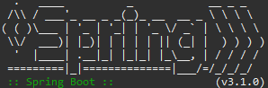
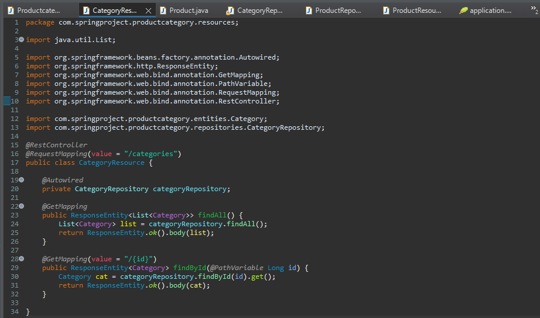
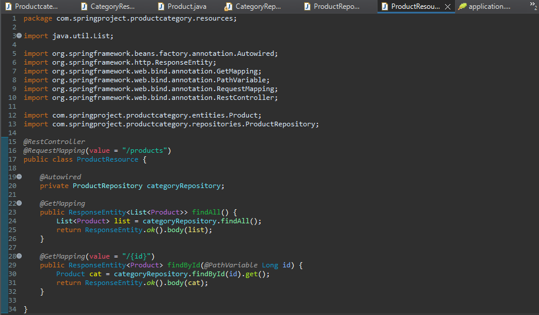
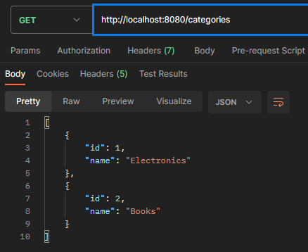
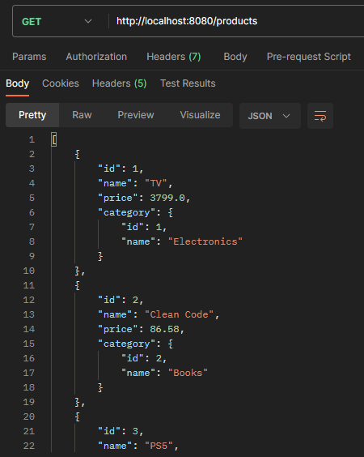
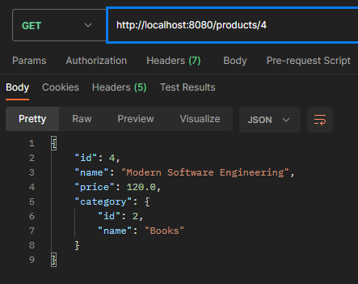
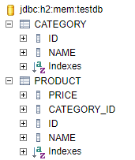
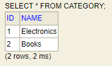
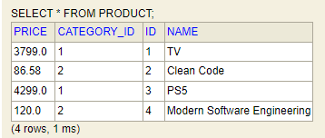

<p align = "center"> 
  
</p>

<h1 align = "center">        
ProdCrafter-API
<h1>

  ## About the project📜
  This is a project where through the Spring Boot framework a small products administrator is created with its data and also its category (associated with the products), the project has the H2 database for visualization in tables and the Postman tool for web visualization, in JSON format.
  
  ## Technologies used 💻⚙️ 
- Spring Tool Suite 4 
- JDK 17 
- Maven
- Spring Boot 3.1.0 
- JPA 
- H2 Database 
- Postman

## Examples of features/operations
  ### Creation of endpoints


  
  ### Testing the service using the Postman tool for viewing in JSON format
  ```bash
View of categories
```

  
  ```bash
Products visualization
  ```

  
  ```bash
  Searching for products by ID 
  ```

  
### Code running through H2 database tables
  ```bash
  Database created
  ```

  
  ```bash
  List of categories
  ```

  
```bash
  End result of the project
  ```

